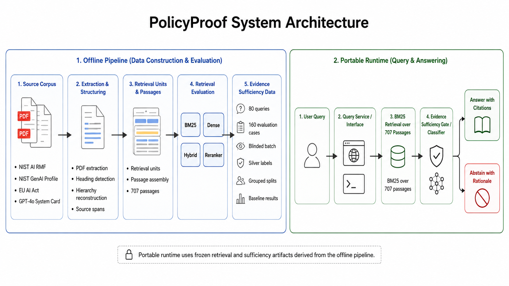

# PolicyProof

PolicyProof is an evidence-first RAG and citation-verification system for public
AI-governance and regulatory documents. It retrieves accepted source passages,
estimates whether the retrieved evidence is sufficient, returns source-derived
excerpts with citations, and abstains when support is weak.

[](#reproducibility)
[](pyproject.toml)
[](docs/deployment.md)

## System architecture



A research-paper-style explanation of the offline and runtime components is
available in [docs/architecture.md](docs/architecture.md).

## Current build

The repository now includes:

- four authoritative AI-governance source documents
- 707 token-safe passages with line-level provenance
- BM25, dense, hybrid-candidate, and cross-encoder retrieval evaluation
- 80 evidence questions and 160 evidence-sufficiency cases
- a blinded annotation batch for future independent human annotation
- 81 sufficient and 79 insufficient construction-derived silver labels
- query-grouped train, validation, and test partitions with no query leakage
- a frozen evidence-sufficiency baseline
- a browser demo and JSON CLI
- a Render Web Service Docker deployment configuration
- 891 passing tests

## Run locally

Start the browser demo:

```bash
./venv/bin/python -m policyproof.demo serve --open
```

Open `http://127.0.0.1:8000/`.

Run one terminal query:

```bash
./venv/bin/python -m policyproof.demo query   "Which characteristics does the NIST AI RMF associate with trustworthy AI?"
```

The response includes:

- `answer` or `abstain`
- sufficiency probability and frozen threshold
- source-derived citation excerpts
- document IDs, labels, passage IDs, and BM25 scores
- ranking, metric, provenance, and responsible-use disclosures

## Public demo

The repository is ready for deployment as a Render Web Service.
See [docs/deployment.md](docs/deployment.md).

**Live URL:** add the https://policyproof-5uwv.onrender.com/ here after deployment.

## Evaluation summary

### Retrieval

The accepted full-corpus results are:

| Method | Recall@10 | MRR@10 | Direct evidence hit@10 | nDCG@10 |
|---|---:|---:|---:|---:|
| BM25 | 0.7760 | 0.7433 | 0.9375 | 0.6555 |
| Dense BGE-small | 0.9688 | 0.9062 | 1.0000 | 0.8866 |
| MiniLM reranker | 0.9271 | 0.8250 | 1.0000 | 0.7893 |

Dense retrieval remains the selected benchmark ranking. Its ONNX model is
hash-verified and kept local rather than committed. The public demo therefore
uses deterministic BM25 for portability.

### Evidence sufficiency

The silver-label evaluation uses query-group isolation:

- train: 48 query groups
- validation: 16 query groups
- test: 16 query groups
- test accuracy: `0.9024`
- test balanced accuracy: `0.8750`
- test F1: `0.8571`

These are construction-derived engineering metrics, not independently
human-adjudicated gold-label results.

## Repository map

- `src/policyproof/` — ingestion, retrieval, evaluation, sufficiency, and demo
- `data/processed/` — immutable passage artifacts
- `data/evaluation/` — case construction, annotation, labels, splits, results
- `data/results/` — retrieval and reranking baselines
- `docs/architecture.md` — research-style system architecture
- `docs/deployment.md` — public Render Web Service deployment
- `docs/engineering-decisions.md` — accepted technical decisions and limits
- `tests/` — regression, artifact-binding, and end-to-end tests

## Reproducibility

Published datasets and results are versioned, SHA-256 bound, and generated with
no-overwrite behavior. Tests enforce corpus, benchmark, split, model-contract,
result, and byte-stability bindings.

The portable demo introduces no new Python runtime dependency or external API
key. The Docker configuration builds the application remotely on Render.

## Responsible-use notice

PolicyProof is a research and compliance-support application. It does not
provide legal advice, determine legal compliance, or replace review by
qualified professionals.
