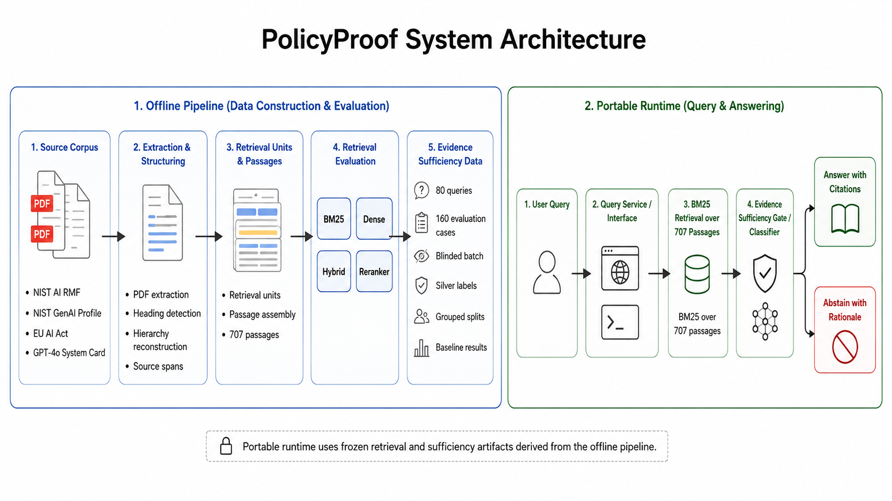
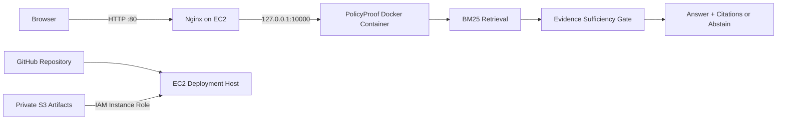

# PolicyProof

PolicyProof is an evidence-first Retrieval-Augmented Generation (RAG) and
citation-verification system for public AI-governance and regulatory documents.

Instead of treating retrieval as a hidden implementation detail, PolicyProof
evaluates retrieval quality explicitly, estimates whether retrieved evidence is
sufficient to support an answer, returns source-derived citations, and abstains
when evidence is weak.

The project is designed around **evaluation, provenance, reproducibility,
failure-aware AI behavior, and production deployment** rather than unrestricted
LLM generation.

[](#reproducibility)
[](pyproject.toml)
[](docs/deployment.md)
[](Dockerfile)

---

## Live Demo

PolicyProof is deployed on AWS using EC2, Docker, Nginx, private S3 artifact
storage, and a least-privilege IAM instance role.

**Application:** http://3.128.255.20/

**Health endpoint:** http://3.128.255.20/api/health

> The current deployment uses an EC2 public IPv4 address. The address may change
> if the instance is stopped and restarted unless a stable IP or domain is
> configured.

---

## System Architecture



A detailed description of the offline evaluation pipeline, runtime retrieval
path, provenance model, and deployment boundaries is available in
[`docs/architecture.md`](docs/architecture.md).

### AWS Deployment Architecture


```mermaid
flowchart LR
    U[Browser] -->|HTTP :80| N[Nginx on EC2]
    N -->|127.0.0.1:10000| D[PolicyProof Docker Container]

    G[GitHub Repository] --> E[EC2 Deployment Host]
    S[Private S3 Artifacts] -->|IAM Instance Role| E

    D --> R[BM25 Retrieval]
    R --> Q[Evidence Sufficiency Gate]
    Q --> A[Answer + Citations or Abstain]
```

The deployed runtime uses:

- **Amazon EC2** for compute
- **Docker** for application packaging
- **Nginx** as the public reverse proxy
- **Amazon S3** for private deployment-artifact storage
- **IAM instance roles** for temporary AWS credentials
- **loopback-only application binding** on port `10000`
- public HTTP traffic exposed through Nginx on port `80`

No long-lived AWS access keys are stored in the repository or on the EC2 host.

---

## Why PolicyProof

Many RAG demos stop at:

```text
documents -> vector database -> LLM -> answer
```

That structure does not answer several important engineering questions:

- Did retrieval actually find the relevant evidence?
- How does one retrieval strategy compare with another?
- Can evaluation results be reproduced later?
- Does the system know when retrieved evidence is insufficient?
- Can citations be traced back to exact source material?
- Can benchmark, dataset, and model artifacts be tied to immutable versions?
- Can deployment preserve the same artifact contracts used during evaluation?

PolicyProof treats those questions as first-class system requirements.

The resulting workflow is closer to:

```text
controlled corpus
      |
      v
deterministic ingestion
      |
      v
provenance-preserving passages
      |
      v
retrieval benchmarking
      |
      v
evidence-sufficiency evaluation
      |
      v
frozen evaluation artifacts
      |
      v
retrieval + sufficiency gate
      |
      +------ sufficient ------> cited answer
      |
      +------ insufficient ----> abstain
```

---

## Current Build

The repository currently includes:

- four authoritative AI-governance source documents
- 707 token-safe passages with source provenance
- BM25 retrieval evaluation
- dense BGE-small retrieval evaluation
- hybrid candidate generation
- MiniLM cross-encoder reranking evaluation
- 80 evidence questions
- 160 evidence-sufficiency cases
- query-grouped train, validation, and test partitions
- construction-derived sufficient and insufficient evidence labels
- a frozen evidence-sufficiency baseline
- explicit abstention behavior
- browser demo and JSON CLI
- deterministic deployment artifacts
- SHA-256 artifact bindings
- AWS EC2 deployment
- private S3 artifact storage
- least-privilege IAM access
- Dockerized runtime
- Nginx reverse proxy
- **891 passing automated tests**

---

## Retrieval Evaluation

PolicyProof compares multiple retrieval strategies against the same frozen
evaluation corpus.

### Accepted Full-Corpus Results

| Method | Recall@10 | MRR@10 | Direct Evidence Hit@10 | nDCG@10 |
|---|---:|---:|---:|---:|
| BM25 | 0.7760 | 0.7433 | 0.9375 | 0.6555 |
| Dense BGE-small | **0.9688** | **0.9062** | **1.0000** | **0.8866** |
| MiniLM reranker | 0.9271 | 0.8250 | **1.0000** | 0.7893 |

Dense retrieval remains the strongest benchmarked ranking method in the current
evaluation.

The deployed portable demo intentionally uses deterministic BM25 retrieval
rather than bundling the dense ONNX asset into the public runtime.

This distinction is explicit:

```text
best evaluated retrieval:
Dense BGE-small

portable deployed runtime:
Deterministic BM25
```

The deployed runtime therefore does not imply that BM25 was the strongest
retrieval method in the benchmark.

---

## Evidence Sufficiency

Retrieval alone does not guarantee that the retrieved evidence is sufficient to
support an answer.

PolicyProof therefore includes a separate evidence-sufficiency stage.

The evaluation dataset contains complete, incomplete, and distractor evidence
cases grouped by query identity.

### Dataset Split

```text
train:      48 query groups
validation: 16 query groups
test:       16 query groups
```

Query-group isolation prevents related evidence variants from leaking between
training and evaluation partitions.

### Frozen Test Results

| Metric | Result |
|---|---:|
| Accuracy | 0.9024 |
| Balanced Accuracy | 0.8750 |
| F1 | 0.8571 |

These metrics use **construction-derived silver labels**.

They are engineering evaluation results and are not presented as independently
human-adjudicated gold-label performance.

---

## Runtime Behavior

A runtime query follows this path:

```text
user question
      |
      v
BM25 retrieval over 707 accepted passages
      |
      v
candidate evidence selection
      |
      v
evidence-sufficiency model
      |
      +------ evidence sufficient
      |            |
      |            v
      |      source-derived answer
      |      + citations
      |      + passage IDs
      |      + document IDs
      |      + retrieval metadata
      |
      +------ evidence insufficient
                   |
                   v
                abstain
```

Responses expose the evidence and system metadata required to inspect how the
decision was reached.

Depending on the query, the response can include:

- `answer` or `abstain`
- sufficiency probability
- frozen decision threshold
- source-derived citation excerpts
- document IDs
- passage IDs
- source labels
- BM25 scores
- ranking metadata
- label-provenance disclosures

---

## Example Query

Start the local demo and ask:

```text
What risks does unauthorized voice generation create, and how does GPT-4o mitigate them?
```

A supported response can contain:

- an evidence-backed answer
- sufficiency probability
- source-derived excerpts
- document provenance
- passage provenance
- retrieval scores

An unsupported query should trigger explicit abstention instead of unsupported
generation.

---

## Run Locally

### Requirements

- Python 3.12
- Git

Clone the repository:

```bash
git clone https://github.com/Bad33/policyproof.git
cd policyproof
```

Create a virtual environment:

```bash
python3.12 -m venv .venv
source .venv/bin/activate
```

Install:

```bash
python -m pip install --upgrade pip
python -m pip install -e .
```

Start the browser demo:

```bash
python -m policyproof.demo serve --open
```

Then open:

```text
http://127.0.0.1:8000/
```

Run a terminal query:

```bash
python -m policyproof.demo query \
  "What risks does unauthorized voice generation create, and how does GPT-4o mitigate them?"
```

---

## Docker

The repository includes a production Dockerfile.

Build:

```bash
docker build -t policyproof:latest .
```

Run:

```bash
docker run --rm \
  -p 10000:10000 \
  -e PORT=10000 \
  policyproof:latest
```

Then open:

```text
http://127.0.0.1:10000/
```

Health check:

```bash
curl http://127.0.0.1:10000/api/health
```

---

## AWS Deployment

The current public deployment runs on Amazon EC2.

Detailed deployment documentation is available in:

[`docs/deployment.md`](docs/deployment.md)

### Deployment Flow

```text
GitHub repository
        |
        v
Amazon EC2
        |
        +--------------------------+
        |                          |
        v                          v
private S3                  Docker build
artifacts                        |
        ^                        v
        |                 PolicyProof container
        |                        |
        |                        v
IAM instance role        127.0.0.1:10000
                                 |
                                 v
                               Nginx
                                 |
                                 v
                              Internet
```

### S3 Deployment Artifacts

The private deployment bucket contains:

```text
retrieval-passages-v1.1.jsonl.gz

evidence-sufficiency-silver-baseline-v0.1.0.json
```

The bucket has public access blocked.

EC2 retrieves the files using an IAM instance role rather than long-lived
access keys.

### IAM Boundary

The EC2 deployment role is restricted to the PolicyProof deployment bucket.

Required permissions are limited to:

```text
s3:ListBucket
s3:GetObject
```

No account-wide S3 administrative permission is required.

### Network Boundary

The PolicyProof Docker container is started with:

```bash
-p 127.0.0.1:10000:10000
```

The Python application is therefore not directly exposed to the internet.

Nginx accepts public requests and forwards them internally to:

```text
127.0.0.1:10000
```

The deployment security group permits:

```text
22  SSH    administrator IP only
80  HTTP   public
443 HTTPS  reserved for future TLS configuration
```

Application port `10000` is not publicly exposed.

---

## Deployment Automation

The AWS deployment script is located at:

```text
deploy/aws/deploy.sh
```

Set the deployment bucket:

```bash
export POLICYPROOF_BUCKET="your-private-policyproof-bucket"
```

Then run:

```bash
./deploy/aws/deploy.sh
```

The script:

1. retrieves the accepted deployment artifacts from S3
2. builds the Docker image
3. removes the previous application container
4. launches the new PolicyProof container
5. performs a health check
6. fails the deployment if the application does not become healthy

This keeps deployment behavior repeatable rather than relying on an undocumented
sequence of manual commands.

---

## Reproducibility

Reproducibility is a core system requirement.

Published datasets and evaluation outputs are versioned and SHA-256 bound.

Tests enforce contracts around:

- corpus identity
- source provenance
- benchmark identity
- dataset construction
- train/validation/test splits
- model contracts
- frozen evaluation outputs
- deployment artifacts
- byte stability
- retrieval behavior
- evidence-sufficiency behavior
- end-to-end runtime behavior

The repository currently contains:

```text
891 passing tests
```

Generated artifacts use no-overwrite behavior where appropriate so previously
accepted results cannot silently be replaced.

---

## Provenance Model

PolicyProof maintains provenance across multiple stages.

A runtime evidence passage retains relationships to:

```text
source document
      |
      v
source coordinates
      |
      v
logical retrieval unit
      |
      v
token-safe passage
      |
      v
retrieval result
      |
      v
citation
```

The system separates:

- retrieval text
- citation text
- source identity
- source coordinates
- passage identity
- retrieval score

This prevents retrieval-specific formatting from being confused with
source-derived citation evidence.

---

## Repository Structure

```text
policyproof/
├── data/
│   ├── deployment/
│   ├── evaluation/
│   ├── processed/
│   └── results/
│
├── deploy/
│   └── aws/
│       ├── deploy.sh
│       └── nginx-policyproof.conf
│
├── docs/
│   ├── architecture.md
│   ├── deployment.md
│   ├── engineering-decisions.md
│   └── assets/
│
├── evaluation/
│
├── scripts/
│
├── src/
│   └── policyproof/
│
├── tests/
│
├── Dockerfile
├── pyproject.toml
└── README.md
```

Key locations:

- `src/policyproof/` — ingestion, retrieval, evaluation, sufficiency, and demo
- `data/deployment/` — deterministic transport artifacts used for deployment
- `data/evaluation/` — evidence cases, labels, splits, and frozen baselines
- `data/results/` — retrieval and reranking evaluation results
- `deploy/aws/` — AWS deployment automation and Nginx configuration
- `docs/architecture.md` — detailed system architecture
- `docs/deployment.md` — AWS deployment architecture and procedure
- `docs/engineering-decisions.md` — accepted technical decisions and limitations
- `tests/` — regression, integrity, artifact-binding, and end-to-end tests

---

## Engineering Decisions

PolicyProof deliberately makes several conservative engineering choices.

### Deterministic public runtime

The deployed demo uses BM25 because it is:

- deterministic
- portable
- inexpensive
- reproducible
- independent of external model APIs

Dense retrieval remains benchmarked separately.

### Explicit abstention

The system can refuse to answer when retrieved evidence is insufficient rather
than attempting to generate a plausible unsupported response.

### Immutable evaluation artifacts

Accepted evaluation artifacts are versioned and cryptographically bound to
reduce accidental benchmark drift.

### Query-group isolation

Evidence variants belonging to the same query remain within the same dataset
partition to reduce leakage.

### Private deployment artifacts

Deployment artifacts are stored in private S3 rather than being exposed as
public object URLs.

### Temporary AWS credentials

EC2 obtains S3 permissions through an IAM instance role instead of permanent
AWS access keys.

---

## Responsible-Use Notice

PolicyProof is a research and compliance-support application.

It does **not**:

- provide legal advice
- determine legal compliance
- replace qualified legal or policy review
- guarantee that its source corpus is current or comprehensive
- claim independently human-adjudicated evidence-sufficiency accuracy

The current evidence-sufficiency evaluation uses construction-derived silver
labels.

Runtime outputs should therefore be treated as evidence-support tooling rather
than authoritative legal conclusions.

---

## Limitations

Current limitations include:

- the deployed runtime uses BM25 rather than the strongest evaluated dense
  retriever
- evidence-sufficiency labels are construction-derived
- the corpus is intentionally frozen and limited in scope
- the system does not perform live web retrieval
- the public deployment currently uses HTTP rather than a custom-domain HTTPS
  endpoint
- the EC2 public IPv4 address may change after instance stop/start
- PolicyProof is designed for research and compliance support, not autonomous
  legal decision-making

---

## Tech Stack

### AI / Retrieval

- Retrieval-Augmented Generation concepts
- BM25 retrieval
- BGE-small dense retrieval evaluation
- MiniLM cross-encoder reranking evaluation
- evidence-sufficiency modeling
- abstention
- provenance-aware citation handling

### Backend

- Python 3.12
- NumPy
- ONNX Runtime
- deterministic HTTP demo server

### Evaluation

- Recall@10
- MRR@10
- nDCG@10
- direct-evidence hit rate
- accuracy
- balanced accuracy
- F1
- query-group-isolated evaluation

### Infrastructure

- Amazon EC2
- Amazon S3
- AWS IAM
- Docker
- Nginx
- Ubuntu Linux

### Engineering

- SHA-256 artifact binding
- deterministic builds
- frozen evaluation artifacts
- regression testing
- health checks
- reproducible deployment
- least-privilege cloud access

---

## Status

PolicyProof currently has:

```text
707 accepted passages
80 evidence questions
160 evidence-sufficiency cases
891 passing tests

Dense retrieval Recall@10: 0.9688
Dense retrieval MRR@10:    0.9062

Evidence sufficiency:
Accuracy:          0.9024
Balanced Accuracy: 0.8750
F1:                0.8571

Deployment:
AWS EC2 + Docker + Nginx + private S3 + IAM
```

The system is actively maintained as an applied AI engineering and
reproducibility project.
